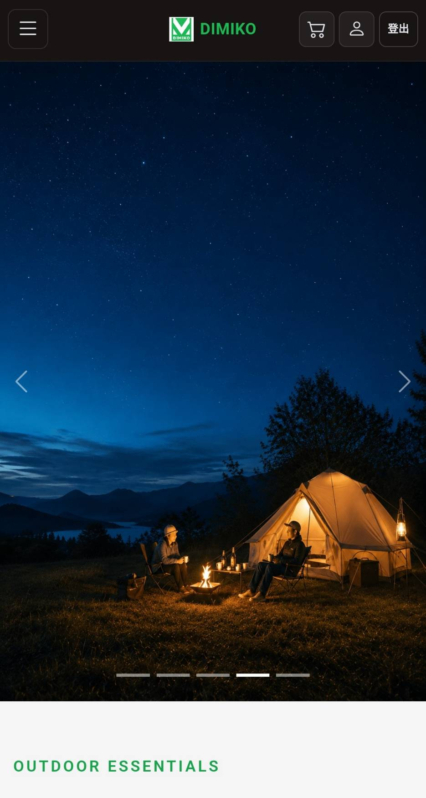

# DIMIKO

DIMIKO 是一個使用 ASP.NET Core MVC 建立的露營用品電商專案，整合商品展示、購物車、會員系統、訂單流程、藍新金流付款，以及具備角色授權的後台管理功能。

專案採用分層架構，將 MVC UI、商業邏輯、資料存取、模型與共用工具分離，作為 ASP.NET Core MVC、Entity Framework Core、Identity 與第三方金流整合的實作。

## Preview

<table width="100%">
    <tr>
    <td width="50%">
    &nbsp;
    <br>
    <p align="center">
    Desktop
    </p>
    
    </td>
    <td width="21%"
    <br>
    <p align="center">
    Mobile
    </p>
    
    </td>
    </tr>
</table>

## 專案功能

### 前台網站

- 首頁商品展示與輪播
- 商品列表與商品詳細頁面
- 商品分類顯示
- 商品圖片與多圖展示
- 會員註冊
- 會員登入與登出
- 忘記密碼與 Email 密碼重設
- 購物車新增、修改數量與刪除商品
- 購物車即時計算商品金額
- 不同購買數量套用對應商品價格
- 結帳資料填寫與驗證
- 建立訂單
- 藍新金流付款流程
- 藍新金流付款成功與失敗結果處理
- 未付款訂單於付款期限內重新付款
- 每次付款使用獨立交易編號
- 付款完成後更新訂單與付款狀態
- 我的訂單列表
- 訂單詳細資料查詢
- 響應式版面設計

### 後台管理

- 管理員登入
- ASP.NET Core Identity 身分驗證
- Role-based Authorization 角色授權
- 分類新增、修改與刪除
- 商品新增、修改與刪除
- 商品啟用與停用
- 商品多圖片管理
- 商品首圖設定
- 使用者管理
- 訂單月曆檢視
- 每日訂單列表
- 共用分頁功能
- 訂單狀態篩選
- 訂單詳細資料管理
- 確認訂單
- 訂單處理流程
- 物流公司與追蹤編號設定
- 標記訂單已出貨
- 取消訂單與庫存恢復
- 付款狀態管理
- 前台與後台導覽列 Active 狀態顯示

## 使用技術

### Web

- ASP.NET Core MVC
- C#
- Razor Views
- HTML
- CSS
- JavaScript
- Bootstrap
- Bootstrap Icons

### Backend

- ASP.NET Core
- Entity Framework Core
- ASP.NET Core Identity
- Role-based Authorization
- Dependency Injection
- Service Layer
- Repository Pattern
- Data Annotations
- Custom Validation Attribute

### Payment

- NewebPay 藍新金流
- MPG 付款流程
- NotifyURL / ReturnURL 回傳流程
- Payment Transaction 付款交易紀錄
- 付款成功與失敗狀態處理
- 未付款訂單重新付款

### Database

- SQL Server
- Azure SQL Database

### Development Tools

- Git
- GitHub
- Visual Studio
- Entity Framework Core CLI
- Azure App Service

## 專案結構

```text
ECommerce/
├─ ECommerce.Web/                          # ASP.NET Core MVC UI、Controllers、Views
├─ ECommerce.Business.Services/            # 商業邏輯與 Service 實作
├─ ECommerce.Business.Services.IServices/  # Service 介面
├─ ECommerce.DataAccess/                   # DbContext、Repository、Migrations
├─ ECommerce.Models/                       # Entity、ViewModel
├─ ECommerce.Utility/                      # 共用常數、驗證與工具
├─ .gitignore
└─ README.md
```

## 本機執行方式

### 開發環境需求

- .NET 10 SDK
- Visual Studio 2026 18.0 以上
- SQL Server

### 1. 下載專案

```bash
git clone https://github.com/jampeng-rd/DIMIKO.git

cd DIMIKO
```

### 2. 開啟專案

使用 Visual Studio 開啟專案的 Solution 檔案。

Visual Studio 會自動還原專案所需的 NuGet 套件。

### 3. 設定 User Secrets

進入 MVC Web 專案：

```bash
cd ECommerce.Web
```

本專案的管理員帳號、藍新金流與 Gmail SMTP 敏感資料使用 ASP.NET Core User Secrets 管理，不需要將實際帳號或金鑰寫入 `appsettings.json`。

如果專案尚未初始化 User Secrets，可執行：

```bash
dotnet user-secrets init
```

接著開啟本機的 `secrets.json`，加入以下設定：

```json
{
  "InitialAdmin": {
    "Email": "預設管理員帳號",
    "Password": "預設管理員密碼"
  },
  "NewebPay": {
    "MerchantId": "",
    "HashKey": "",
    "HashIV": ""
  },
  "GmailSmtp": {
    "Username": "YOUR_GMAIL@gmail.com",
    "AppPassword": "YOUR_GMAIL_APP_PASSWORD"
  }
}
```

設定說明：

- `InitialAdmin:Email`：系統初始化時建立的預設管理員 Email。
- `InitialAdmin:Password`：預設管理員密碼。
- `NewebPay:MerchantId`：藍新金流測試商店代號。
- `NewebPay:HashKey`：藍新金流 HashKey。
- `NewebPay:HashIV`：藍新金流 HashIV。
- `GmailSmtp:Username`：用於寄送忘記密碼 Email 的 Gmail 帳號。
- `GmailSmtp:AppPassword`：Gmail 應用程式密碼。

> `secrets.json` 位於開發電腦的 User Secrets 儲存位置，不應加入 Git 或提交至 GitHub。

### 4. 套用資料庫 Migration

在 Visual Studio 中開啟：

`工具 → NuGet 套件管理員 → 套件管理器主控台`

接著執行：

```powershell
Update-Database -Context ApplicationDbContext -Project ECommerce.DataAccess -StartupProject ECommerce.Web
```

或使用 .NET CLI：

```bash
dotnet ef database update   --context ApplicationDbContext   --project ECommerce.DataAccess   --startup-project ECommerce.Web
```

### 5. 啟動專案

將 `ECommerce.Web` 設為啟動專案後，使用 Visual Studio 執行專案。

## 身分驗證與授權

系統使用 ASP.NET Core Identity 管理會員帳號、登入狀態、密碼與角色授權。

一般會員可以使用前台購物、購物車、結帳與訂單查詢功能；管理員則可進入後台管理商品、分類、使用者與訂單。

### 登入流程

1. 使用者輸入 Email 與密碼。
2. ASP.NET Core Identity 驗證帳號與密碼。
3. 驗證成功後建立登入 Cookie。
4. 後續 Request 由 ASP.NET Core Identity 判斷登入狀態與角色。
5. 需要特定角色的後台功能透過 Authorization 限制存取。

### 忘記密碼流程

1. 使用者輸入註冊 Email。
2. 系統確認帳號後產生 Password Reset Token。
3. 系統寄送密碼重設連結至使用者 Email。
4. 使用者透過重設頁面輸入新密碼。
5. ASP.NET Core Identity 驗證 Token 後完成密碼更新。

為避免洩漏帳號是否存在，忘記密碼功能不應直接向使用者顯示指定 Email 是否已註冊。

## 購物車與價格

使用者登入後可以將商品加入購物車，並在購物車中修改數量或移除商品。

系統會依購買數量套用商品不同級距的價格，並重新計算購物車總金額。

購物車資料依登入使用者保存，不同會員之間的購物車資料彼此獨立。

## 訂單流程

目前主要訂單流程：

```text
   加入購物車
       ↓
   確認購物車
       ↓
  填寫結帳資料
       ↓
    建立訂單
       ↓
 建立付款交易紀錄
       ↓
 前往藍新金流付款
       ↓
  付款結果通知
       ↓
┌──────────────┐
│              │
付款成功      付款失敗
│              │
↓              ↓
更新付款狀態   保持待付款狀態
│              │
↓              ↓
訂單完成頁     我的訂單詳細頁
               ↓
        付款期限內重新付款
               ↓
        建立新的付款交易
               ↓
        再次前往藍新付款

       ↓
  後台確認訂單
       ↓
    開始處理
       ↓
填寫物流公司與追蹤編號
       ↓
   標記已出貨
```

### 訂單狀態

目前使用的主要訂單狀態：

- Pending
- Approved
- Processing
- Shipped
- Cancelled

### 付款狀態

目前使用的主要付款狀態：

- Pending
- Approved
- Rejected
- Refunded

取消符合條件的訂單時，系統會將原訂購數量恢復至商品庫存。

## 藍新金流

> 本機 `localhost` 可執行一般網站、會員、購物車與訂單功能，但藍新金流付款結果需要可由外部存取的回傳網址，因此完整金流流程需部署至公開環境後進行測試。

專案使用 NewebPay 藍新金流進行付款流程。

### 測試信用卡

使用藍新金流測試環境時，可使用以下測試信用卡資料：

- 信用卡號：`4000-2211-1111-1111`
- 有效期限：填寫晚於目前日期的未來日期，例如 `12/30`
- 安全碼（CVV）：`123`

> 以上資料僅適用於藍新金流測試環境，不可用於正式交易。

主要流程包含：

- 建立訂單後產生付款交易紀錄
- 每次付款產生獨立的 `MerchantOrderNo`
- 產生藍新 MPG 所需交易資訊
- 導向藍新付款頁面
- 透過 `NotifyURL` 接收伺服器端付款通知
- 驗證藍新回傳資料
- 記錄單次付款成功或失敗狀態
- 付款成功後更新訂單付款狀態
- 付款失敗時保留訂單待付款狀態
- 未超過付款期限的訂單可重新付款
- 重新付款時建立新的付款交易紀錄與 `MerchantOrderNo`
- 付款成功後導向訂單完成頁面
- 付款失敗後導向我的訂單詳細頁面

### 付款交易紀錄說明

系統將網站訂單與單次金流交易分開管理。

- `OrderHeader.OrderNumber`：網站訂單編號，一張訂單固定不變。
- `PaymentTransaction.MerchantOrderNo`：每次送往藍新付款時產生的獨立交易編號。
- 一張訂單可以包含多筆付款交易紀錄。
- 付款失敗時只將該次付款交易標記為失敗，訂單仍保持 `待付款` 狀態。
- 使用者重新付款時會建立新的付款交易紀錄，不重複使用前一次的 `MerchantOrderNo`。
- 任一付款交易成功後，系統會將訂單付款狀態更新為已付款。

## 後台訂單管理

後台訂單管理以月曆作為主要入口，可查看指定月份中有訂單的日期，並進入每日訂單列表。

每日訂單列表支援共用分頁功能，預設每頁顯示 7 筆資料，並可切換：

- 5 筆
- 7 筆
- 10 筆
- 15 筆
- 20 筆

訂單詳細頁面可依目前訂單狀態執行對應操作，例如確認訂單、開始處理、設定物流資訊、標記已出貨或取消訂單。

## 商品圖片管理

商品支援多張圖片，並可指定其中一張作為首圖。

主要功能包含：

- 新增商品時上傳圖片
- 修改商品時保留既有圖片
- 新增多張商品圖片
- 刪除一般圖片
- 刪除首圖後自動選擇下一張圖片作為首圖
- 前台商品列表與詳細頁顯示商品圖片
- 商品沒有圖片時顯示預設佔位內容

## 專案特色

### ASP.NET Core MVC 架構

專案使用 ASP.NET Core MVC 與 Razor Views 建立網站，不採前後端分離架構，頁面、Controller 與後端功能整合於 MVC 應用程式中。

### 分層設計

專案將 UI、商業邏輯、資料存取、模型與共用工具拆分至不同 Project，降低各層之間的耦合並提升維護性。

### Service Layer

Controller 不直接集中處理所有商業邏輯，而是透過 Service Interface 與 Service 實作執行商品、購物車與訂單等功能。

### Identity 驗證與角色授權

使用 ASP.NET Core Identity 管理會員帳號與 Cookie 登入狀態，並透過角色授權限制管理後台功能。

### 共用分頁元件

後台列表使用共用 `PaginationViewModel` 與 `_Pagination.cshtml`，可在不同管理頁面重複使用相同的分頁邏輯與 UI。

### 自訂台灣電話驗證

結帳資料使用自訂 Validation Attribute 驗證台灣手機與市內電話格式，並整合 ASP.NET Core Model Validation。

### 金流整合

透過 NewebPay 測試環境實作第三方付款流程，包含交易資料產生、付款結果處理與訂單付款狀態更新。

### 響應式設計

網站使用 Bootstrap 與自訂 CSS，支援桌面、平板與手機畫面。

## 專案狀態

目前主要功能已完成：

- ASP.NET Core MVC 網站架構
- SQL Server / Azure SQL Database
- 商品分類管理
- 商品管理
- 商品多圖片管理
- 前台商品展示
- 商品詳細頁面
- 會員註冊
- 會員登入與登出
- 忘記密碼與 Email 密碼重設
- ASP.NET Core Identity
- 角色授權
- 購物車
- 數量級距價格
- 結帳流程
- 訂單建立
- 我的訂單
- 後台訂單管理
- 訂單月曆
- 共用分頁功能
- 訂單狀態流程
- 庫存管理
- 物流資訊管理
- NewebPay 藍新金流
- 藍新付款成功與失敗流程
- 未付款訂單重新付款
- 付款交易紀錄管理
- Azure 部署相關設定
- 響應式版面設計

## 作者

Jam

Email：

```text
jampeng.rd@gmail.com
```

## 使用說明

本專案目前作為 ASP.NET Core MVC 電商功能實作、第三方服務整合與展示用途。

未經作者同意，請勿直接複製、修改或重新發布專案內容。
